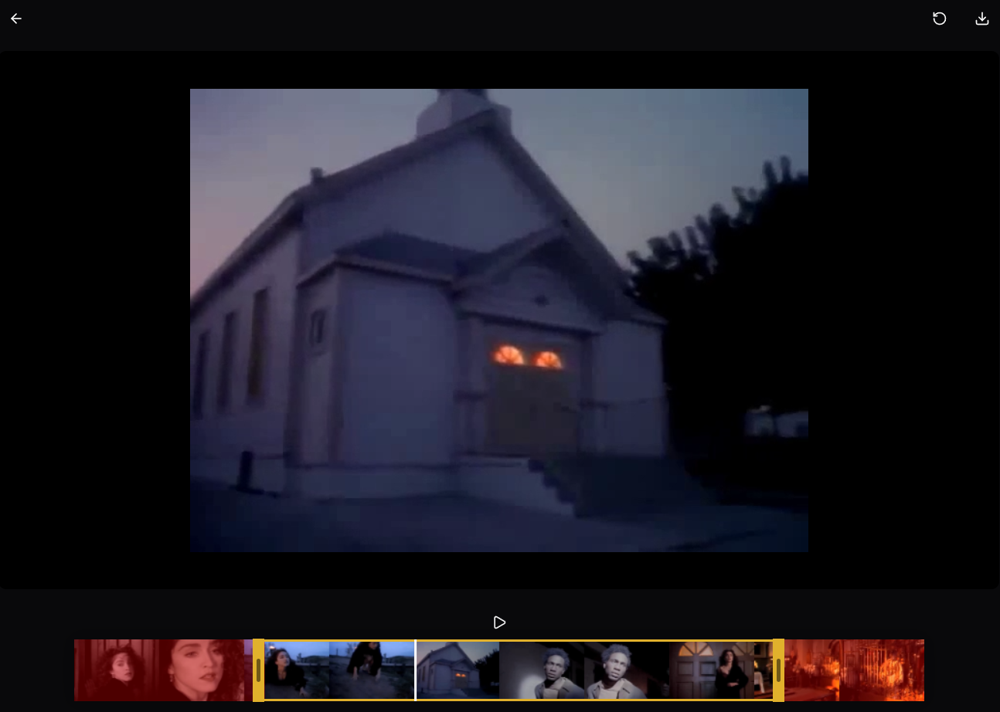

# 🎬 trim.mov - Video Trimmer



_Screenshot showing the video trimmer interface with church scene, timeline thumbnails, and control buttons_

A modern, responsive web-based video editor that allows you to trim videos locally without watermarks. Built with React, TypeScript, and native browser APIs for maximum compatibility across all platforms.

## ✨ Features

- **🎥 Local Video Processing**: No server uploads, everything happens in your browser
- **✂️ Precise Trimming**: Interactive timeline with drag handles for exact video cutting
- **🖼️ Visual Thumbnails**: See video frames along the timeline for better navigation
- **📱 Responsive Design**: Works perfectly on desktop, tablet, and mobile devices
- **🚀 No Watermarks**: Clean, professional video output
- **⚡ Fast Processing**: Optimized for performance with native browser APIs
- **🌐 Cross-Platform**: Works on Windows, Ubuntu, macOS, and any modern browser

## 🛠️ Tech Stack

- **Frontend**: React 19 + TypeScript
- **Build Tool**: Vite
- **State Management**: Zustand
- **Styling**: CSS with responsive design
- **Video Processing**: Native Canvas API + MediaRecorder
- **Package Manager**: pnpm

## 🚀 Quick Start

### Prerequisites

- Node.js 18+
- pnpm (recommended) or npm

### Installation

```bash
# Clone the repository
git clone https://github.com/yourusername/trimmer.git
cd trimmer

# Install dependencies
pnpm install

# Start development server
pnpm dev

# Build for production
pnpm build
```

## 📖 Usage

1. **Select Video**: Click "Choose File" to select your video
2. **Preview**: Watch your video in the player
3. **Trim**: Use the timeline to set start and end points
   - Drag the yellow handles to adjust trim points
   - See thumbnails for visual reference
   - Use the play button to preview
4. **Download**: Click the download button to get your trimmed video

## 🎯 Key Components

### Video Player

- Canvas-based video rendering
- Responsive scaling
- Smooth playback controls

### Timeline

- Interactive drag handles
- Visual thumbnails
- Real-time preview
- Responsive width (80% of viewport)

### Thumbnail Generation

- Automatic frame extraction
- Aspect ratio preservation
- Dynamic recalculation on resize
- Performance optimized

## 🔧 Configuration

### Timeline Width

The timeline automatically adjusts to 80% of the viewport width:

- Desktop: 80vw (max 1000px)
- Tablet: 90vw
- Mobile: 95vw

### Supported Formats

- **Input**: MP4, WebM, MOV, AVI (any browser-supported format)
- **Output**: WebM (universal compatibility)

## 🚀 Performance Features

- **Debounced Resize**: Smooth thumbnail updates
- **Canvas Optimization**: GPU-accelerated rendering
- **Memory Management**: Efficient frame processing
- **Responsive Design**: No scrollbars, perfect viewport fit

## 🐛 Troubleshooting

### Common Issues

**Video not loading?**

- Check file format compatibility
- Ensure file size is reasonable
- Try a different browser

**Thumbnails not showing?**

- Wait for video to fully load
- Check browser console for errors
- Try refreshing the page

**Download not working?**

- Check browser permissions
- Ensure sufficient disk space
- Try a different video format

## 🤝 Contributing

1. Fork the repository
2. Create a feature branch
3. Make your changes
4. Test thoroughly
5. Submit a pull request

## 📄 License

This project is licensed under the MIT License - see the [LICENSE](LICENSE) file for details.

## 🙏 Acknowledgments

- Built with modern web standards
- Inspired by professional video editing tools
- Designed for simplicity and performance

---

**Made with ❤️ for video creators everywhere**
